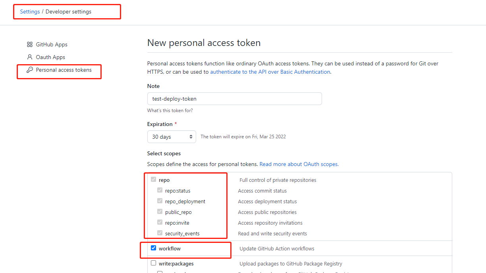
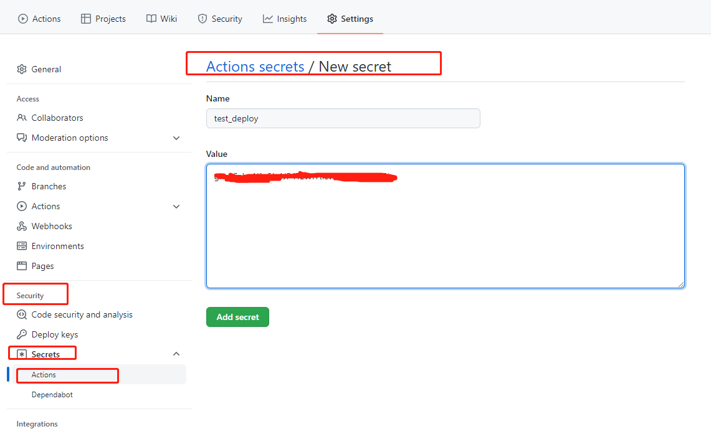

# Vue 3.x 项目工程环境搭建

## 技术栈

编程语言：[TypeScript 4.x](https://link.juejin.cn?target=https%3A%2F%2Fwww.typescriptlang.org%2Fzh%2F) + [JavaScript](https://link.juejin.cn?target=https%3A%2F%2Fwww.javascript.com%2F)

构建工具：[Vite 2.x](https://link.juejin.cn?target=https%3A%2F%2Fcn.vitejs.dev%2F)

前端框架：[Vue 3.x](https://link.juejin.cn?target=https%3A%2F%2Fv3.cn.vuejs.org%2F)

路由工具：[Vue Router 4.x](https://link.juejin.cn?target=https%3A%2F%2Fnext.router.vuejs.org%2Fzh%2Findex.html)

状态管理：[Vuex 4.x](https://link.juejin.cn?target=https%3A%2F%2Fnext.vuex.vuejs.org%2F)

UI 框架：[Element Plus](https://link.juejin.cn?target=https%3A%2F%2Felement-plus.org%2F%23%2Fzh-CN)

CSS 预编译：[Stylus](https://link.juejin.cn?target=https%3A%2F%2Fstylus-lang.com%2F) / [Sass](https://link.juejin.cn?target=https%3A%2F%2Fsass.bootcss.com%2Fdocumentation) / [Less](https://link.juejin.cn?target=http%3A%2F%2Flesscss.cn%2F)

HTTP 工具：[Axios](https://link.juejin.cn?target=https%3A%2F%2Faxios-http.com%2F)

Git Hook 工具：[husky](https://link.juejin.cn?target=https%3A%2F%2Ftypicode.github.io%2Fhusky%2F%23%2F) + [lint-staged](https://link.juejin.cn?target=https%3A%2F%2Fgithub.com%2Fokonet%2Flint-staged)

代码规范：[EditorConfig](https://link.juejin.cn?target=http%3A%2F%2Feditorconfig.org) + [Prettier](https://link.juejin.cn?target=https%3A%2F%2Fprettier.io%2F) + [ESLint](https://link.juejin.cn?target=https%3A%2F%2Feslint.org%2F) + [Airbnb JavaScript Style Guide](https://link.juejin.cn?target=https%3A%2F%2Fgithub.com%2Fairbnb%2Fjavascript%23translation)

提交规范：[Commitizen](https://link.juejin.cn?target=http%3A%2F%2Fcommitizen.github.io%2Fcz-cli%2F) + [Commitlint](https://link.juejin.cn?target=https%3A%2F%2Fcommitlint.js.org%2F%23%2F)

单元测试：[vue-test-utils](https://link.juejin.cn?target=https%3A%2F%2Fnext.vue-test-utils.vuejs.org%2F) + [jest](https://link.juejin.cn?target=https%3A%2F%2Fjestjs.io%2F) + [vue-jest](https://link.juejin.cn?target=https%3A%2F%2Fgithub.com%2Fvuejs%2Fvue-jest) + [ts-jest](https://link.juejin.cn?target=https%3A%2F%2Fkulshekhar.github.io%2Fts-jest%2F)

自动部署：[GitHub Actions](https://link.juejin.cn?target=https%3A%2F%2Fdocs.github.com%2Fcn%2Factions%2Flearn-github-actions)

## 架构搭建

### Vite

```js
yarn create @vitejs/app
```


```js
// vite.config.js

import { defineConfig } from 'vite';
import vue from '@vitejs/plugin-vue';
import { resolve } from 'path';

// https://vitejs.dev/config/
export default defineConfig({
  plugins: [vue()],
  resolve: {
    alias: {
      '@': resolve(__dirname, 'src')
    }
  },
  base: './',
  // vite build 打包出现警告
  css: {
    postcss: {
      plugins: [
        {
          postcssPlugin: 'internal:charset-removal',
          AtRule: {
            charset: (atRule) => {
              if (atRule.name === 'charset') {
                atRule.remove();
              }
            }
          }
        }
      ]
    }
  },
  server: {
    port: 4000,
    open: true,
    cors: true

    // 设置代理，根据我们项目实际情况配置
    // proxy: {
    //   '/api': {
    //     target: 'http://xxx.xxx.xxx.xxx:8000',
    //     changeOrigin: true,
    //     secure: false,
    //     rewrite: (path) => path.replace('/api/', '/')
    //   }
    // }
  }
});
```


### vue-router、vuex

```js
yarn add vue-router@next vuex@next
```

### Element Plus

```js
yarn add element-plus
```

### Axios

```js
yarn add axios
```

### Less

Vite 内部已帮我们集成相关的 loader，不需要额外配置。你也可以使用 Sass、Less、Stylus。 

```js
yarn add less
```

## 

## 代码风格

### EditorConfig

```bash
# .editorconfig

# Editor configuration, see http://editorconfig.org

# 表示是最顶层的 EditorConfig 配置文件
root = true

[*] # 表示所有文件适用
charset = utf-8 # 设置文件字符集为 utf-8
indent_style = space # 缩进风格（tab | space）
indent_size = 2 # 缩进大小
end_of_line = lf # 控制换行类型(lf | cr | crlf)
trim_trailing_whitespace = true # 去除行首的任意空白字符
insert_final_newline = true # 始终在文件末尾插入一个新行

[*.md] # 表示仅 md 文件适用以下规则
max_line_length = off
trim_trailing_whitespace = false
```


VSCode 推荐安装 EitorConfig for VS Code 插件。

### Prettier

```js
yarn add prettier -D
```

```js
// .prettierrc

{
  "useTabs": false,
  "tabWidth": 2,
  "printWidth": 100,
  "singleQuote": true,
  "trailingComma": "none",
  "bracketSpacing": true,
  "semi": true
}
```

官网配置：[Prettier-Options](https://link.juejin.cn/?target=https%3A%2F%2Fprettier.io%2Fdocs%2Fen%2Foptions.html)


```bash
# 格式化所有文件（. 表示所有文件）
npx prettier --write .
```


VSCode 推荐安装 Prettier - Code formatter 插件。

### ESLint

ESLint 三种规范：

* [airbnb](https://github.com/airbnb/javascript)
* [standard](https://github.com/standard/standard)
* [google](https://github.com/google/eslint-config-google)


```js
yarn add eslint -D
```

 ```js
 npx eslint --init
 ```

```js
// .eslintrc.js

module.exports = {
  env: {
    browser: true,
    es2021: true
  },
  extends: ['plugin:vue/essential', 'airbnb-base'],
  parserOptions: {
    ecmaVersion: 'latest',
    parser: '@typescript-eslint/parser',
    sourceType: 'module'
  },
  plugins: ['vue', '@typescript-eslint'],
  rules: {
    'vue/multi-word-component-names': 'off',
    'no-plusplus': 'off',
    'import/no-extraneous-dependencies': ['error', { devDependencies: true }],
    'no-param-reassign': [
      'error',
      {
        props: true,
        ignorePropertyModificationsFor: ['state']
      }
    ]
  }
};
```


vscode 自动设置保存文件执行 eslint --fix

```js
// settings.json

"editor.codeActionsOnSave": {
  "source.fixAll.eslint": true
}
```


VSCode 推荐安装 ESLint 插件。

### ESLint 与 Prettier 冲突

* eslint-plugin-prettier：将 Prettier 的规则设置到 ESLint 的规则中
* eslint-config-prettier：关闭 ESLint 中与 Prettier 中会发生冲突的规则

校验优先级：Prettier 配置规则 > ESLint 配置规则

```js
module.exports = {
  ...
  extends: [
    'plugin:vue/essential',
    'airbnb-base',
    'plugin:prettier/recommended' // 添加 prettier 插件
  ]
}
```

### ESLint 解析 alias

```js
yarn add eslint-import-resolver-alias -D
```

```js
settings: {
  'import/resolver': {
    alias: {
      map: [['@', './src']],
      extensions: ['.js', '.vue']
    }
  }
}
```

### 代码校验

禁止提交未通过 ESLint 检测的代码。 

#### husky

```js
npx husky-init && npm install // 快速初始化 husky 配置
```

这行命令做了以下操作：

* 安装 husky 到开发依赖
* 在项目根目录下创建 `.husky` 目录，并创建 `pre-commit` hook，初始化 `pre-commit` 命令为 `npm test`
* 修改 `package.json` 的 `scripts`，增加 `"prepare": "husky install"`


修改 pre-commit 钩子。

```js
// .husky/pre-commit

eslint --fix ./src --ext .vue,.js,.ts
```

当我们执行 `git commit -m "xxx"` 时，会先对 `src` 目录下所有的 `.vue`、`.js`、`.ts ` 文件执行  `eslint --fix` 命令，如果 ESLint 通过，成功 `commit`，否则终止 `commit`。有时候我们明明只改动了一两个文件，却要对所有的文件执行 `eslint --fix`。我们要做到只用 ESLint 修复自己此次写的代码，而不去影响其他的代码。所我们还需借助 **lint-staged** 。

#### lint-staged

lint-staged 这个工具一般结合 husky 来使用，它可以让 husky 的 hook 触发的命令只作用于暂存区的文件，而不会影响到其他文件。

```js
yarn add lint-staged -D
```

只对 git 暂存区的 .vue、.js、.ts 文件执行 eslint --fix

```js
// package.json

"lint-staged": {
  "*.{vue,js,ts}": "eslint --fix"
}

```

修改 pre-commit 命令

```js
// .husky/pre-commit

npx lint-staged
```

## 提交规范

### 规范介绍

使用社区最流行、最知名、最受认可的 Angular 团队提交规范。

[angular项目提交记录](https://github.com/angular/angular/commits/master)


**commit message**

commit message  格式规范

```js
<Header>

<Body>

<Footer>
```


**规范提交信息的好处：**

首行就是简洁实用的关键信息，方便在 git history 中快速浏览；

具有更加详细的 body 和 footer，可以清晰的看出某次提交的目的和影响；

可以通过 type 过滤出想要查找的信息，也可以通过关键字快速查找相关提交；

可以直接从 commit 生成 change log。

### Header

```js
<type>(<scope>): <subject>
```

Header 部分包括三个字段 type（必需）、scope（可选）和 subject（必需）。

#### type

```js
// type 用于说明 commit 的提交类型（必须是以下几种之一）。
```

| 值       | 描述                                                         |
| -------- | ------------------------------------------------------------ |
| feat     | 新增一个功能                                                 |
| fix      | 修复一个 Bug                                                 |
| docs     | 文档变更                                                     |
| style    | 代码格式（不影响功能，例如空格、分号等格式修正）             |
| refactor | 代码重构                                                     |
| perf     | 改善性能                                                     |
| test     | 测试                                                         |
| build    | 变更项目构建或外部依赖（例如 scopes: webpack、gulp、npm 等） |
| ci       | 更改持续集成软件的配置文件和 package 中的 scripts 命令，例如 scopes: Travis, Circle 等 |
| chore    | 变更构建流程或辅助工具                                       |
| revert   | 代码回退                                                     |

#### scope

scope 用于指定本次 commit 影响的范围。

scope 依据项目而定，例如在业务项目中可以依据菜单或者功能模块划分，如果是组件库开发，则可以依据组件划分。

#### subject

subject 是本次 commit 的简洁描述，长度约定在 50 个字符以内，通常遵循以下几个规范：

* 用动词开头，第一人称现在时表述，例如：change 代替 changed 或 changes
* 第一个字母小写
* 结尾不加句号（.)
  

### Body

body 是对本次 commit 的详细描述，可以分成多行（body 可省略）。

跟 subject 类似，用动词开头，body 应该说明修改的原因和更改前后的行为对比。


### Footer

如果本次提交的代码是突破性的变更或关闭缺陷，则 Footer 必需，否则可以省略。

**突破性的变更**

当前代码与上一个版本有突破性改变，则 Footer 以 BREAKING CHANGE 开头，后面是对变动的描述、以及变动的理由。

**关闭缺陷**

如果当前提交是针对特定的 issue，那么可以在 Footer 部分填写需要关闭的单个 issue 或一系列 issues。


### 参考案例

#### feat

```js
feat(browser): onUrlChange event (popstate/hashchange/polling)

Added new event to browser:
- forward popstate event if available
- forward hashchange event if popstate not available
- do polling when neither popstate nor hashchange available

Breaks $browser.onHashChange, which was removed (use onUrlChange instead)
```

#### fix

```js
fix(compile): couple of unit tests for IE9

Older IEs serialize html uppercased, but IE9 does not...
Would be better to expect case insensitive, unfortunately jasmine does
not allow to user regexps for throw expectations.

Closes #392
Breaks foo.bar api, foo.baz should be used instead
```

#### style

```js
style(location): add couple of missing semi colons
```

#### chore

```js
chore(release): v3.4.2
```

## 规范提交代码

Commitizen 是一个帮助撰写规范 commit message 的工具。它有一个命令行工具 cz-cli

### 安装使用

```js
yarn add commitizen -D
```

```js
npx commitizen init cz-conventional-changelog --save-dev --save-exact
```

这行命令做了两件事

* 安装 cz-conventional-changelog 到开发依赖（devDependencies）

* 在 `package.json` 中增加了 `config.commitizen`

  ```js
  "config": {
    "commitizen": {
      "path": "./node_modules/cz-conventional-changelog"
    }
  }
  ```

  

```js
git cz // 使用 git 命令
```

> windows 可以配置 script 脚本或者全局安装 commitizen。

### 自定义提交说明（可选）

`git cz`  终端操作提示都是英文的，如果想改成中文的或者自定义这些配置选项，可以使用 **cz-customizable** 适配器。

**cz-customizable 初始化项目**

```bash
npx commitizen init cz-customizable --save-dev --save-exact --force
```

这个命令做了两件事

* 安装 cz-customizable 到开发依赖（devDependencies）

  ```js
  "devDependencies": {
    "cz-customizable": "^6.3.0",
  }
  ```

* 修改 `package.json` 中的 `config.commitizen` 字段

  ```js
  "config": {
    "commitizen": {
      "path": "./node_modules/cz-customizable"
    }
  }
  ```

**使用 cz-customizable**

项目根目录下创建 `.cz-config.js` 文件。

```js
module.exports = {
  // type 类型（定义之后，可通过上下键选择）
  types: [
    { value: 'feat', name: 'feat:     新增功能' },
    { value: 'fix', name: 'fix:      修复 bug' },
    { value: 'docs', name: 'docs:     文档变更' },
    { value: 'style', name: 'style:    代码格式（不影响功能，例如空格、分号等格式修正）' },
    { value: 'refactor', name: 'refactor: 代码重构（不包括 bug 修复、功能新增）' },
    { value: 'perf', name: 'perf:     性能优化' },
    { value: 'test', name: 'test:     添加、修改测试用例' },
    { value: 'build', name: 'build:    构建流程、外部依赖变更（如升级 npm 包、修改 webpack 配置等）' },
    { value: 'ci', name: 'ci:       修改 CI 配置、脚本' },
    { value: 'chore', name: 'chore:    对构建过程或辅助工具和库的更改（不影响源文件、测试用例）' },
    { value: 'revert', name: 'revert:   回滚 commit' }
  ],

  // scope 类型（定义之后，可通过上下键选择）
  scopes: [
    ['components', '组件相关'],
    ['hooks', 'hook 相关'],
    ['utils', 'utils 相关'],
    ['element-ui', '对 element-ui 的调整'],
    ['styles', '样式相关'],
    ['deps', '项目依赖'],
    ['auth', '对 auth 修改'],
    ['other', '其他修改'],
    // 如果选择 custom，后面会让你再输入一个自定义的 scope。也可以不设置此项，把后面的 allowCustomScopes 设置为 true
    ['custom', '以上都不是？我要自定义']
  ].map(([value, description]) => {
    return {
      value,
      name: `${value.padEnd(30)} (${description})`
    }
  }),

  // 是否允许自定义填写 scope，在 scope 选择的时候，会有 empty 和 custom 可以选择。
  // allowCustomScopes: true,

  // allowTicketNumber: false,
  // isTicketNumberRequired: false,
  // ticketNumberPrefix: 'TICKET-',
  // ticketNumberRegExp: '\\d{1,5}',


  // 针对每一个 type 去定义对应的 scopes，例如 fix
  /*
  scopeOverrides: {
    fix: [
      { name: 'merge' },
      { name: 'style' },
      { name: 'e2eTest' },
      { name: 'unitTest' }
    ]
  },
  */

  // 交互提示信息
  messages: {
    type: '确保本次提交遵循 Angular 规范！\n选择你要提交的类型：',
    scope: '\n选择一个 scope（可选）：',
    // 选择 scope: custom 时会出下面的提示
    customScope: '请输入自定义的 scope：',
    subject: '填写简短精炼的变更描述：\n',
    body:
      '填写更加详细的变更描述（可选）。使用 "|" 换行：\n',
    breaking: '列举非兼容性重大的变更（可选）：\n',
    footer: '列举出所有变更的 ISSUES CLOSED（可选）。 例如: #31, #34：\n',
    confirmCommit: '确认提交？'
  },

  // 设置只有 type 选择了 feat 或 fix，才询问 breaking message
  allowBreakingChanges: ['feat', 'fix'],

  // 跳过要询问的步骤
  // skipQuestions: ['body', 'footer'],

  // subject 限制长度
  subjectLimit: 100
  breaklineChar: '|', // 支持 body 和 footer
  // footerPrefix : 'ISSUES CLOSED:'
  // askForBreakingChangeFirst : true,
}
```

很多时候我们不需要写长描述，公司内部的代码仓库也不需要管理 issue，那么可以把询问 body 和 footer 的步骤跳过（在 `.cz-config.js` 中修改成 `skipQuestions: ['body', 'footer']`。

### Commitlint 验证提交规范

**只让符合 Angular 规范的 commit message 通过**，我们借助 @commitlint/config-conventional 和 @commitlint/cli 来实现。

```js
yarn add @commitlint/config-conventional @commitlint/cli -D
```

```js
// commitlint.config.js

module.exports = { extends: ['@commitlint/config-conventional'] }
```

使用 husky 的  `commit-msg`  hook 触发验证提交信息的命令

```js
npx husky add .husky/commit-msg "npx --no-install commitlint --edit $1"
```

测试代码提交时就会触发 commit-msg 钩子，校验提交信息。

## 单元测试

### 安装配置

单元测试是项目开发中一个非常重要的环节，完整的测试能为代码和业务提供质量保证，减少 Bug 的出现。

```js
yarn add @vue/test-utils@next jest vue-jest@next ts-jest -D // vue 组件单元测试
```


```js
// jest.config.js

module.exports = {
  moduleFileExtensions: ['vue', 'js', 'ts'],
  preset: 'ts-jest',
  testEnvironment: 'jsdom',
  transform: {
    '^.+\\.vue$': 'vue-jest', // vue 文件用 vue-jest 转换
    '^.+\\.ts$': 'ts-jest' // ts 文件用 ts-jest 转换
  },
  // 匹配 __tests__ 目录下的 .js/.ts 文件 或其他目录下的 xx.test.js/ts xx.spec.js/ts
  testRegex: '(/__tests__/.*|(\\.|/)(test|spec))\\.(ts)$'
}
```

### 创建单元配置文件

我们配置只匹配 `__tests__` 目录下的任意 `.ts` 文件或其他目录下的 `xx.test.ts`/`xx.spec.ts` 文件进行单元测试。

```js
├── compoents/
├── src/
└── tests/                           // 单元测试目录
    ├── Test.spec.ts                 // Test 组件测试
```


**src/components/Test/index.vue**

```vue
<template>
  <div class="test-container page-container">
    <div class="page-title">Unit Test Page</div>
    <p>count is: {{ count }}</p>
    <button @click="increment">increment</button>
  </div>
</template>

<script lang="ts">
import { defineComponent, ref } from 'vue';

export default defineComponent({
  name: 'Vuex',
  setup() {
    const count = ref<number>(0);
    const increment = () => {
      count.value += 1;
    };
    return { count, increment };
  }
});
</script>
```

tests/Test.spec.ts

```js
import { mount } from '@vue/test-utils'
import Test from '../src/views/Test.vue'

test('Test.vue', async () => {
  const wrapper = mount(Test)
  expect(wrapper.html()).toContain('Unit Test Page')
  expect(wrapper.html()).toContain('count is: 0')
  await wrapper.find('button').trigger('click')
  expect(wrapper.html()).toContain('count is: 1')
});
```

### 无法解析 test 问题解决

IDE 会提示某些方法不存在（如 `test`、`describe`、`it`、`expect`等），安装 @types/jest 即可解决。

```js
yarn add @types/jest -D 
```

TypeScript 的编译器也会提示 jest 的方法和类型找不到，我们还需把 @types/jest 添加根目录下的 `ts.config.json`（TypeScript 配置文件）中：

```js
{
  "compilerOptions": {
    "types": ["vite/client", "jest"]
  }
}
```


在 ESLint 中增加 **eslint-plugin-jest** 插件来解除对 jest 的校验。

```js
yarn add eslint-plugin-jest -D
```

```js
// .eslintrc.js

module.exports = {
  extends: [
    'plugin:jest/recommended'
  ],
}
```

### 执行单元测试

编写 scripts 脚本，package.json 配置文件。

```js
"scripts": {
  "dev": "vite",
  "build": "vue-tsc --noEmit && vite build",
  "preview": "vite preview",
  "prepare": "husky install",
  "cz": "git cz",
  "test": "jest"
}
```

你可以在 `jest.config.js` 配置文件中，自由配置单元测试文件的目录。


可能会出现以下错误：

```js
 Cannot destructure property 'config' of 'undefined' as it is undefined.
```

需要 jest 和 ts-jest 版本降级。

```js
"jest": "^26.6.3",
"ts-jest": "^26.5.6"
```

```js
yarn remove jest ts-jest
```

```js
yarn add jest@^26.6.3 ts-jest@^26.5.6
```

### 单元测试约束

我们使用 husky 在 Git 的 `pre-commit` 和 `commit-msg` 阶段分别约束代码风格规范和提交信息规范。
我们可以在  `pre-push` 阶段进行单元测试，只有单元测试全部通过才让代码 `push` 到远端仓库，否则终止 `push`。

```js
npx husky add .husky/pre-push "npm run test $1"
```

该命令会在 `.husky` 文件下创建 `pre-push` 命令

```js
#!/bin/sh
. "$(dirname "$0")/_/husky.sh"

npm run test 
```

## 自动部署（可选）

常见的 CI 工具有 GitHub Actions、GitLab CI、Travis CI、Circle CI 等，这里使用 Github Actions。

GitHub Actions 是 GitHub 的持续集成服务，持续集成由很多操作组成，比如抓取代码、运行测试、登录远程服务器、发布到第三方服务等等，GitHub 把这些操作称为 actions。

### 部署 Github 仓库

GitHub Actions 只对 GitHub 仓库有效，所以我们创建 GitHub 仓库来托管项目代码。

- `master` 分支存储项目源代码
- `gh-pages` 分支存储打包后的静态文件

`gh-pages` 分支，是 GitHub Pages 服务的固定分支，可以通过 HTTP 的方式访问到这个分支的静态文件资源。

### 创建 Github Token

创建一个有 **repo** 和 **workflow** 权限的 [GitHub Token](https://link.juejin.cn/?target=https%3A%2F%2Fgithub.com%2Fsettings%2Ftokens%2Fnew)。

步骤：personal info - Settings - Developer settings - Personal access tokens。





**生成的 token 只会显示一次，需要自主保存，如果遗失，可以重新生成**

### 仓库中添加 secret

步骤：settings - Secrets - Actions secrets - New repository secret





新创建的 secret `test_deploy` 在 Actions 配置文件中要用到，两个地方需保持一致！

> name 名称如果写小写，会自动转为大写。

### 创建 Actions 配置文件

1. 在项目根目录下创建 `.github` 目录。
2. 在 `.github` 目录下创建 `workflows` 目录。
3. 在 `workflows` 目录下创建 `deploy.yml` 文件。


```yaml
name: deploy

on:
  push:
    branches: [master] # master 分支有 push 时触发

jobs:
  deploy:
    runs-on: ubuntu-latest
    steps:
      - uses: actions/checkout@v2

      - name: Setup Node.js v14.x
        uses: actions/setup-node@v1
        with:
          node-version: '14.x'

      - name: Install
        run: npm install # 安装依赖

      - name: Build
        run: npm run build # 打包

      - name: Deploy
        uses: peaceiris/actions-gh-pages@v3 # 使用部署到 GitHub pages 的 action
        with:
          publish_dir: ./dist # 部署打包后的 dist 目录
          github_token: ${{ secrets.TEST_DEPLOY }} # secret 名  ★★★
          user_name: ${{ secrets.MY_USER_NAME }}
          user_email: ${{ secrets.MY_USER_EMAIL }}
          commit_message: Update Vite2.x + Vue3.x + TypeScript Starter # 部署时的 git 提交信息，自由填写

```

### 自动触发原理

当有新提交的代码 `push` 到 GitHub 仓库时，就会触发 GitHub Actions，在 GitHub 服务器上执行 Action 配置文件里面的命令。
例如：**安装依赖**、**项目打包**等，然后将打包好的静态文件部署到 GitHub Pages 上，最后，我们就能通过域名访问了。

自动部署只是 GitHub Actions 功能的冰山一角，GitHub Actions 能做的事还有很多，大家感兴趣的话自行查阅。


预览地址：https://yw0525.github.io/vite-vue3-starter/#/。

构建失败会发邮件通知，也可以查看项目  Actions 模板查看构建进度。

